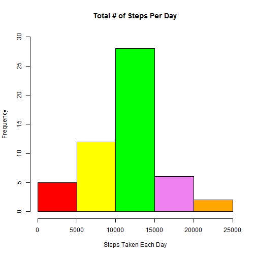
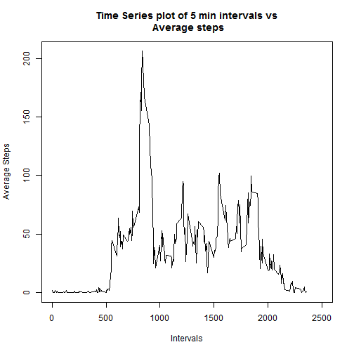
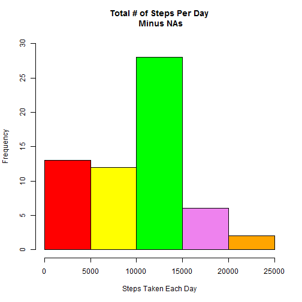
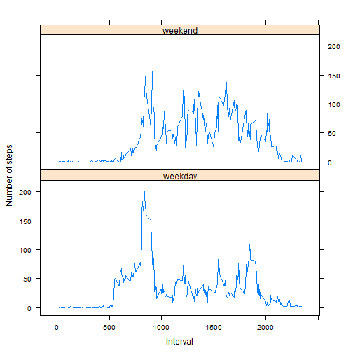

Reproducible Research: Peer Assessment 1
========================================


## Loading and preprocessing the data

Unzip the supplied zip file from the cloned github repo and extract the activity file in csv format. Ignore the NAs for now.


```r
unzip("activity.zip",exdir="activity")
d<-read.csv(file="activity/activity.csv",sep=",",header=TRUE)
#Ignore NA's, remove them from the data set for now
no_na_data<-subset(d,!is.na(d$steps))
```

## What is mean total number of steps taken per day?

Question 1

Make a histogram of total number of steps taken each day.

```r
sum_of_steps_per_day<-aggregate(no_na_data$steps,by=list(no_na_data$date),sum)
colors = c("red", "yellow", "green", "violet", "orange") 
hist(sum_of_steps_per_day$x,col=colors, main="Total # of Steps Per Day",
     xlab="Steps Taken Each Day", ylim=c(0,30))
```

 

Question 2 

Calculate and report the mean and median total number of steps taken
per day.

The mean is 37.3825996. The median is 0.

## What is the average daily activity pattern?

Question 1

Plot a time series of 5-minute intervals by the average number of steps.

```r
avg_steps_per_interval<-tapply(no_na_data$steps,no_na_data$interval,mean)
#there are 288 intervals from 0 to 2355 
plot(unique(no_na_data$interval),avg_steps_per_interval,type='l',
     xlim=c(0,2500), xlab="Intervals", ylab="Average Steps", 
     main="Time Series plot of 5 min intervals vs\n Average steps")
```

 

Question 2

Which 5-minute interval, on average across all the days in the dataset, contains the maximum number of steps?
To find this answer use the previously generated array that contains the average steps per interval. Get the maximum average from it, then find where it resides in the array (i.e., at what dimension). The dimension value is the time interval during the day that the maximum average steps occurred.

```r
##Interval 835 contains 206.200
#Round out the array to get whole numbers only
in_here<-round(avg_steps_per_interval)
#Do the same for the max average
max_avg<-max(avg_steps_per_interval)
find_this<-round(max_avg)
#Locate it (the max value)
results<-match(find_this,in_here)
#Now do a reverse lookup - what is the interval for this max average?
tmp<-as.matrix(avg_steps_per_interval[results])
#The interval is actually the dimension in the array
the_dim<-dimnames(tmp)[1]
```
The 5 Minute Interval with the max number of steps is 835 for 206 steps.
If you look back at the previous plot, around 835 intervals in, you can see it's at the maximum of 206 steps.
              
## Imputing missing values

Question 1

Here's the number of NA's in data frame:

```r
#Get logical array of whether a row has an NA in it or not
data_check<-complete.cases(d)
not_ok<-sum(!data_check)
ok<-sum(data_check)
```
Of the 17568 records, 2304 are NAs and 15264 are valid.

Question 2

This is my strategy for filling in all of the missing values in the dataset. 

1. I'm going to use the median value for each 5 minute interval. I created a dataframe containing the median steps taken per time interval with NAs removed (see df in code chunck below). I opted not to use the MEDIAN or the MEAN for each day where NAs occurred because the NAs appeared for the entire day, not just sections of it. This occurred for 8 days worth of reporting. The MEAN or MEDIAN for those days would have been just 0. Boring.
2. Using the logical array (data_check) I created in Part 1 of this question, I look for rows with steps equal to NA. I replace the step value (in dataframe d) with the median computed for its time interval (found in the aggregate computed below, df).  Example - any NAs found at the time interval equal to 5 will be replaced with the median computed for that time interval (as found in df).

Question 3

I create a new dataset (fixed_one) that is equal to the orginal dataset (d) with 17,568 rows with all NA's replaced with a median value for its time interval:


```r
#Aggregate to get median of the steps, grouped by time interval
df<- aggregate(d$steps,by=list(d$interval),median,na.rm=TRUE)
names(df)<-c("interval","median") 
#See Imputing.R, it replaces the NAs with medians
source("Imputing.R")
fixed_one<-Imputing_NAs(df,d,data_check)
```

I opted to put the logic I needed to replace all NA values with interval medians into a seperate source file called Imputing.R that can be found in this github repo.

Question 4

I created a new histogram of total number of steps taken each day with NAs removed and replaced with Median values: 


```r
new_sum_of_steps_per_day<-tapply(fixed_one$steps,fixed_one$date,sum)
colors = c("red", "yellow", "green", "violet", "orange") 
hist(new_sum_of_steps_per_day,col=colors, main="Total # of Steps Per Day\n Minus NAs",
     xlab="Steps Taken Each Day", ylim=c(0,30))
```

 

I spot checked the data in new_sum_of_steps_per_day vs the histogram. I wanted to see the frequency of total steps less than 5000. Then I checked for between 10 and 15,000.


```r
cnt_under_5k<-0
for(i in 1:length(new_sum_of_steps_per_day)){
        if(new_sum_of_steps_per_day[i]< 5000){
                cnt_under_5k<-cnt_under_5k+1}
}

cnt_10_to_15<-0
for(i in 1:length(new_sum_of_steps_per_day)){
        if(new_sum_of_steps_per_day[i]>= 10000 & 
                new_sum_of_steps_per_day[i]<= 15000){
                     cnt_10_to_15<-cnt_10_to_15+1 }
}
```
I verified that there were 13 instances (frequency @ 13) of total steps per day under 5000. I also verified that there were 28 instances (frequency @ 28) of total steps between 10,000 and 15,000. These can be seen in the histogram above.

I calculated the new Mean and Median of total number of steps taken per day:


```r
the_new_mean<-mean(fixed_one$steps)
the_new_median<-median(fixed_one$steps)
```
The New Mean is 32.9995446. The New Median is 0.

The new median is still 0, it has not changed. That is because of the 17,568 rows, there are over 12,000 zeros for step count. Replacing the NAs had no affect on those 0 counts so there was no impact to the median. 

The new mean with computed values for NAs (32.9995446) is not the same as the original mean with the NAs ignored (37.3825996). That is because the median values I used to replace the steps with NAs are now used in the mean calculation and they are not equal to the original mean. Here is an example:

```r
#Like original data, has an NA
stuff<-as.data.frame(c(2,3,21,58,NA))
names(stuff)<-"ave"
#Compute the mean, ignore the NA data
the_Original_Mean<-mean(stuff$ave,na.rm=TRUE)
#Compute the median
replace_NA_with_This_Median<-median(stuff$ave,na.rm=TRUE)
#Replace the NA value with this median
stuff_with_median<-as.data.frame(c(2,3,21,58,replace_NA_with_This_Median))
names(stuff_with_median)<-"ave"
#Get the new mean
the_new_mean<-mean(stuff_with_median$ave)
```

In my example above, the_Original_Mean with no NAs is 21. I get the median (replace_NA_with_This_Median) 12 and replace the NA. The new mean (the_new_mean) is now 19.2. They are not the same. In this example the original mean is larger than the median I used so the new mean is smaller.

The impact to the value of mean by giving the NAs values will be to increase or decrease the new mean depending upon the scheme used to replace the data. In my scheme, if the median computed per interval is less than the mean of the total daily number of steps, the mean will decrease. This is replicated in my example above.

## Are there differences in activity patterns between weekdays and weekends?

Question  1

Data frame fixed_one was created in code chunck Q41, it is the dataset with the filled-in missing values. Now I'm going to add a new column and fill it with either weekend or weekday as appropriate for the data in the date column.


```r
#Create a new column called Day with two possible values, weekday or weekend
fixed_one$Day<-factor(fixed_one,levels=c("weekday","weekend"))
#See Find_Day_type.R, it determines if a given day is a weekday or weekend
source("Find_Day_type.R")
act_patterns<-Find_Day_Type(fixed_one)
#Test on act_patterns[1500,] Oct 6  is a Saturday 
#Test on act_patterns[17000,] Nov 29 is a Thursday 
check_this_entry<-act_patterns[1500,]
and_check_this_entry<-act_patterns[17000,]
```
I opted to put the logic I needed to determine if a given day was a weekday or weekend into a seperate source file called Find_Day_type.R that can be found in this github repo.
I spot checked act_patterns and found that row 1500 contained [0, 2012-10-06, 455, weekend] which was in fact a weekend day on Saturday and that row 17000 contains [0, 2012-11-29, 35, weekday] and was a weekday on Thursday.

Question 2

First, get seperate average number of steps taken, one for weekdays another for weekends.


```r
weekdays_only<-subset(act_patterns,act_patterns$Day != "weekend")
weekends_only<-subset(act_patterns,act_patterns$Day != "weekday")
weekday_plot<-tapply(weekdays_only$steps,weekdays_only$interval,mean)
weekend_plot<-tapply(weekends_only$steps,weekends_only$interval,mean)
```
Now, create a new data frame of averages. Row bind weekdays followed by weekends.


```r
wday_averages<-data.frame(avg=as.data.frame(weekday_plot),
               interval=unique(act_patterns$interval),day="weekday")
names(wday_averages)<-c("average","interval","day")
wend_averages<-data.frame(avg=as.data.frame(weekend_plot),
               interval=unique(act_patterns$interval),day="weekend")
names(wend_averages)<-c("average","interval","day")
df3<-rbind(wday_averages,wend_averages)
```

Make the plots, one for weekend, one for weekday. Make them as similar to the example provided as possible.


```r
library(lattice)
xyplot(average~interval|day, data=df3, 
       pch=19 ,type="l",layout=c(1,2),xlab="Interval",ylab="Number of steps")
```

 

I spot checked data on both of the graphs. 


```r
#weekday max steps of 205 is @ interval 835
weekdays<-round(weekday_plot)
the_max_step<-round(max(weekday_plot))
the_location<-match(the_max_step,weekdays)
weekday_results<-rownames(as.data.frame(weekday_plot[the_location]))
```
For weekdays I used the max number of steps to find the interval. You can see on the graph that for interval 835 the Number of steps is 205.  

Checking max steps on weekends....


```r
#weekend max steps of 155 is @ interval 915
weekends<-round(weekend_plot)
the_max_weekend_step<-round(max(weekend_plot))
the_weekend_location<-match(the_max_weekend_step,weekends)
weekend_results<-rownames(as.data.frame(weekend_plot[the_weekend_location]))
```
For weekends I used the max number of steps on weekends to find the interval. You can see on the weekend graph that for interval 915 the Number of steps is 155.

